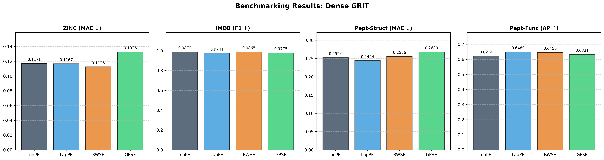
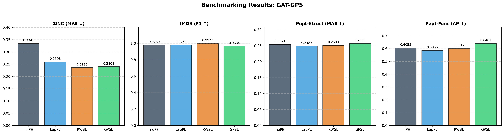

# Benchmarking Graph Transformer Positional Encodings

This document summarizes the results of a comprehensive benchmarking suite comparing **Dense GRIT** (Global Attention) and **GAT-GPS** (Sparse Local Attention) architectures using various Positional and Structural Encodings.

## Summary of Findings
- **Sparse GRIT Breakthrough**: Sparse GRIT (Local Attention) paired with **GPSE** achieved a massive **58.8% improvement** in ZINC MAE (0.0675), dramatically outperforming both Dense (0.1171) and GAT-GPS (0.3341) baselines.
- **Architectural Efficiency**: While Dense models benefit marginally from PE, Sparse models see dramatic boosts when equipped with global structural context. IMDB performance is largely saturated, with local models matching or exceeding global counterparts.
- **Top PE Variant**: **RWSE** and **LapPE** remain the most consistent across all architectures, but **GPSE** shows exceptional sensitivity and high-peak performance in complex classification and localized ZINC regression.

## Holistic Results Matrix

| Dataset | Metric | PE Variant | Dense GRIT | GAT-GPS | Sparse GRIT |
| :--- | :--- | :--- | :--- | :--- | :--- |
| **ZINC** | MAE (↓) | noPE | 0.1171 | 0.3341 | 0.1639 |
| *(Regression)* | | LapPE | 0.1167 | 0.2598 | 0.1236 |
| | | RWSE | **0.1126** | **0.2359** | 0.0871 |
| | | GPSE | 0.1326 | 0.2404 | **0.0675** |
| **IMDB** | F1 (↑) | noPE | **0.9872** | 0.9760 | 0.9848 |
| *(Node Class)* | | LapPE | 0.9741 | 0.9762 | 0.9818 |
| | | RWSE | 0.9865 | **0.9972** | **0.9879** |
| | | GPSE | 0.9775 | 0.9634 | 0.9756 |
| **Peptides-Struct**| MAE (↓) | noPE | 0.2524 | 0.2541 | 0.2659 |
| *(LRGB Reg)* | | LapPE | **0.2444** | **0.2483** | **0.2519** |
| | | RWSE | 0.2556 | 0.2508 | 0.2665 |
| | | GPSE | 0.2680 | 0.2568 | 0.3481 |
| **Peptides-Func** | AP (↑) | noPE | 0.6214 | 0.6058 | 0.4560 |
| *(LRGB Class)* | | LapPE | **0.6489** | 0.5856 | 0.5355 |
| | | RWSE | 0.6456 | 0.6012 | 0.4998 |
| | | GPSE | 0.6321 | **0.6401** | **0.5835** |

## Performance Visualizations

### Dense GRIT

### GAT-GPS

## Archive Details
- **Total Experiments**: 32
- **Logs**: Archived raw logs are available in the repository's `plotting_data/` directory.
