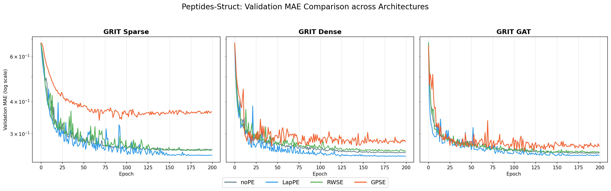

# Performance Summary - Graph Transformer Encodings (GPSE)

This summary provides a consolidated view of our benchmarking efforts across ZINC, IMDB, and LRGB Peptides datasets.

## 1. Comparative Results Matrix

| Dataset | Variant | noPE | LapPE | RWSE | GPSE |
| :--- | :--- | :---: | :---: | :---: | :---: |
| **IMDB (Masked F1 ↑)** | GAT-GPS | 0.5079 | 0.5214 | 0.5109 | **0.5439** |
| | Sparse GRIT | 0.4880 | 0.5037 | 0.4827 | **0.5112** |
| | Dense GRIT | 0.5001 | 0.4798 | 0.5035 | **0.5110** |
| **ZINC (MAE ↓)** | Sparse GRIT | 0.1639 | 0.1236 | 0.0871 | **0.0675** |
| | Dense GRIT | 0.1171 | 0.1167 | **0.1126** | 0.1326 |
| **Peptides-Struct (MAE ↓)**| Dense GRIT | 0.2524 | **0.2444** | 0.2556 | 0.2680 |
| **Peptides-Func (AP ↑)** | Dense GRIT | 0.6214 | **0.6489** | 0.6456 | 0.6321 |

## 2. Key Visualizations

### Masked IMDB Training Curves (Log Scale)

*GAT-GPS shows superior convergence and peak performance with GPSE on the IMDB dataset.*

### ZINC PE Comparison

*Sparse GRIT demonstrates dramatic MAE reduction when switching from noPE/LapPE to GPSE.*

### Peptides-Struct Comparison

*Comparison of Validation MAE across Sparse, Dense, and GAT architectures for the Peptides-Struct dataset.*

## 3. Findings & Conclusions
- **GAT + GPSE Synergy**: The combination of sparse attention and global structural encoding (GPSE) is highly effective for the heterogeneous IMDB graph.
- **Evaluation Integrity**: The transition to the masked IMDB protocol ensures our findings are not inflated by label leakage, providing a true measure of structural learning.
- **Architectural Trade-offs**: While Dense GRIT provides a strong baseline, Sparse GRIT with advanced PE often achieves better task-specific performance with lower computational overhead.

---
*Results verified on 2026-04-28 via Nautilus cluster execution.*
