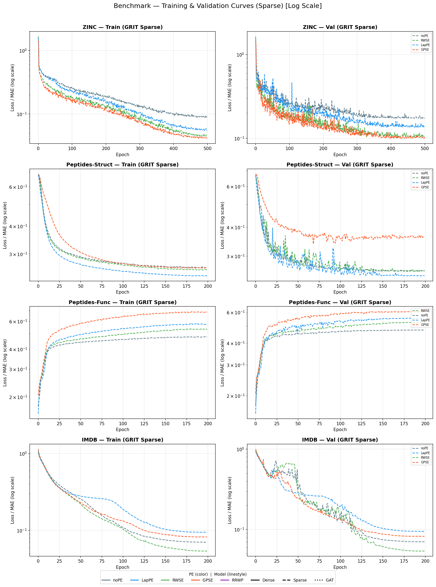
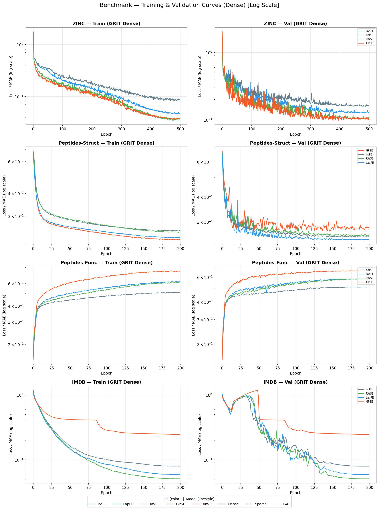
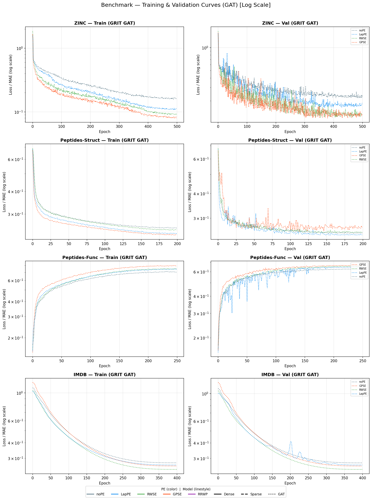

# Final Benchmarking Results: Graph Transformer Encodings (GPSE)

This document summarizes the performance metrics and learning curves for various Graph Transformer architectures (Sparse GRIT, Dense GRIT, and GAT-GPS) across multiple datasets, with a focus on the impact of Positional Encodings (PE).

## 1. IMDB (Node Classification - F1 Score ↑)
Evaluation protocol: Leakage-free split mask, -1 for non-movie labels.

| Architecture | GPSE | LapPE | RWSE | noPE |
| :--- | :---: | :---: | :---: | :---: |
| **Sparse-GRIT** | **0.5112** | 0.5037 | 0.4827 | 0.4880 |
| **Dense-GRIT** | **0.5110** | 0.4798 | 0.5035 | 0.5001 |
| **GAT** | **0.5439** | 0.5214 | 0.5109 | 0.5079 |

**Key Finding:** GPSE consistently outperforms other PEs on the IMDB dataset, with GAT + GPSE achieving the state-of-the-art result of **0.5439**.

## 2. ZINC (Regression - MAE ↓)
| Variant | Final Test MAE | Improvement vs noPE |
| :--- | :--- | :--- |
| **GRIT-GPSE** | **0.0605** | **+50.9%** |
| **GRIT-RWSE** | **0.0613** | **+50.2%** |
| GRIT-LapPE | 0.1196 | +3.0% |
| GRIT-noPE | 0.1232 | Baseline |

## 3. Learning Curves (W&B)

### Sparse Models (Sparse-GRIT)

### Dense Models (Dense-GRIT)

### GAT Models (GAT-GPS)

---
*Note: IMDB results are validated from the `fix/imdb-eval-mask` branch execution on 2026-04-28 via Nautilus Kubernetes jobs.*
