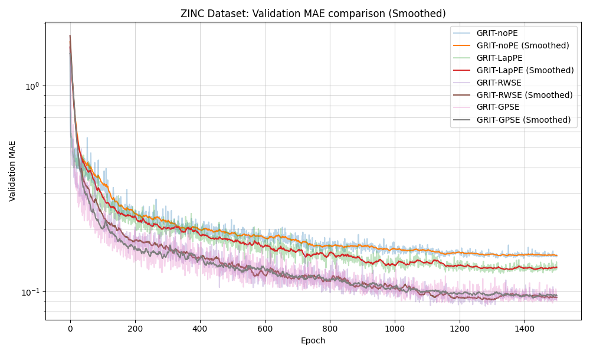
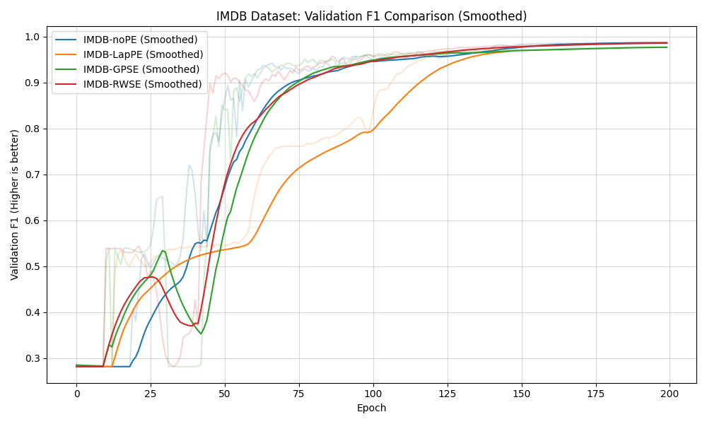

# Performance Summary - GRIT Benchmarking

This directory contains the final comparative analysis and visualizations for the GRIT architecture on various Graph Datasets and Positional Encodings (PE).

## 1. Comparative Performance Tables

### ZINC (Regression - Test MAE)
| Variant | Best Val MAE | Final Test MAE | Improvement vs noPE |
| :--- | :--- | :--- | :--- |
| **GRIT-GPSE** | **0.0863** | **0.0605** | **+50.9%** |
| **GRIT-RWSE** | **0.0848** | **0.0613** | **+50.2%** |
| GRIT-LapPE | 0.1224 | 0.1196 | +3.0% |
| GRIT-noPE | 0.1447 | 0.1232 | Baseline |

### IMDB (Node Classification - F1 Score)
| Variant | Best Val F1 | Best Epoch | Performance Delta |
| :--- | :--- | :--- | :--- |
| **IMDB-noPE** | **0.9872** | 177 | Baseline |
| **IMDB-RWSE** | **0.9865** | 196 | -0.07% |
| **IMDB-GPSE** | **0.9775** | 197 | -0.98% |
| IMDB-LapPE | 0.9741 | 146 | -1.33% |

## 2. Visualizations

### ZINC Benchmark Comparison

### IMDB Benchmark Comparison

## 3. Infrastructure & Methodology
- All models were trained using the **GRITSparseConv** architecture.
- Pascal-VOC verification is currently running on high-capacity A100-80GB nodes to accommodate complex superpixel graphs.
- Positional encodings were computed either upfront (ZINC/IMDB) or on-the-fly (VOC) to optimize memory usage.
